

# Shopper's Delight

## Background

* This was a Requirements Engineering(uni module) assignment which came with the following tasks to do:
  * a use case diagram
  * a prototype of the application

## Use Case Diagram
* Used Draw.io to make a UML use case diagram to represent the stakeholder's requirements.

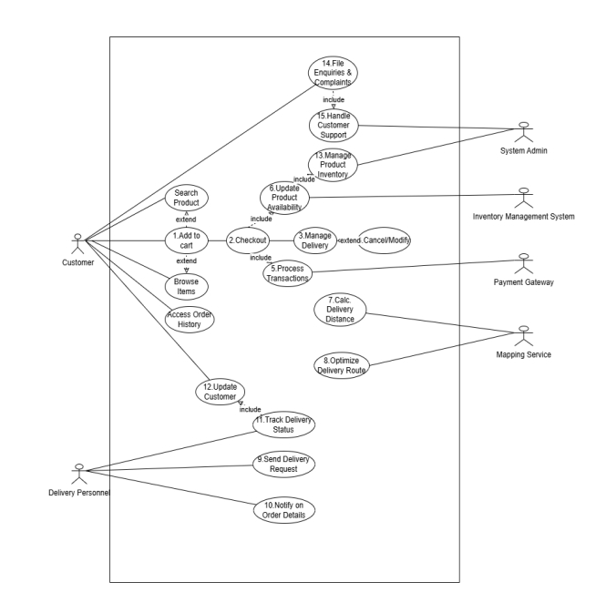

## Prototype
* Designed an interactive prototype with seamless navigation using Figma
* Focuses on the actors on the user side
  * customer
  * deliverer

### Sign-in

* The screens appear for both actors.
* The purpose of the screens is to allow actors who already have an account to continue to the sign-in screen and new actors to continue to the sign-up screen.

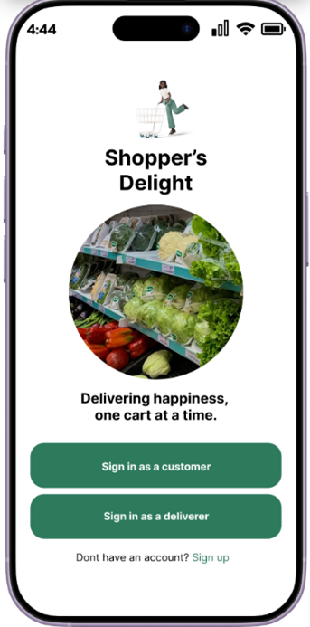
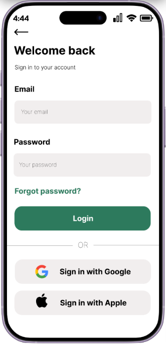

### Sign-up

* Actors who do not have an account can opt to sign-up via these screens.

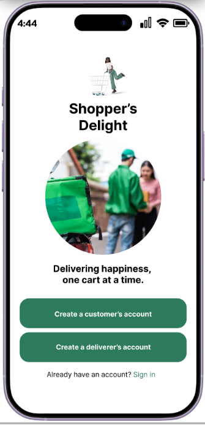
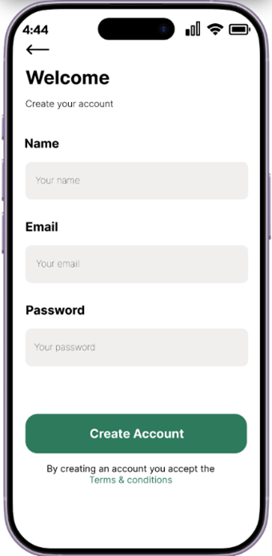

### Home - Customer side

* The purpose of these screens is to allow the customer to browse through different products available on the app, fulfilling the customer’s browse use case

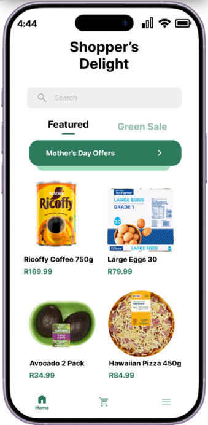
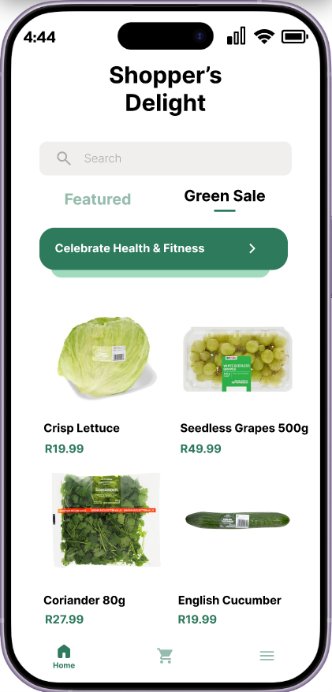

### Search

* Allow for a quick search of a specific product on the app, fulfiling the customer’s search use case

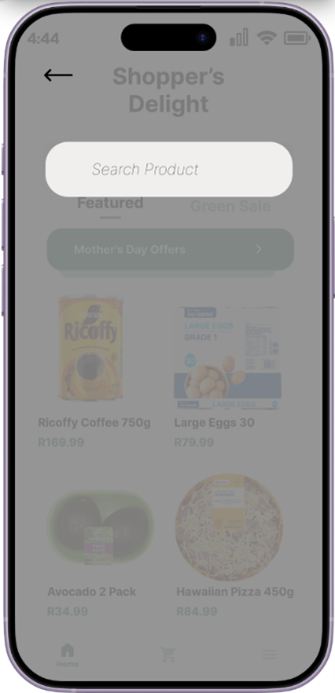

### Product details

* Shows the details of a specific product once it is pressed upon and the option to add it to the cart, fulfilling the add to cart use case.

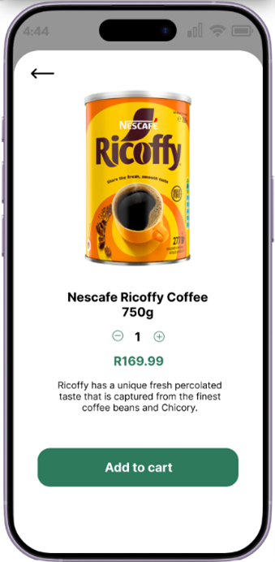
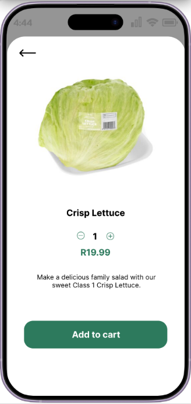

### Checkout

* The screen gives the customer the ability to checkout with the products they have added to their cart, fulfilling the checkout use case

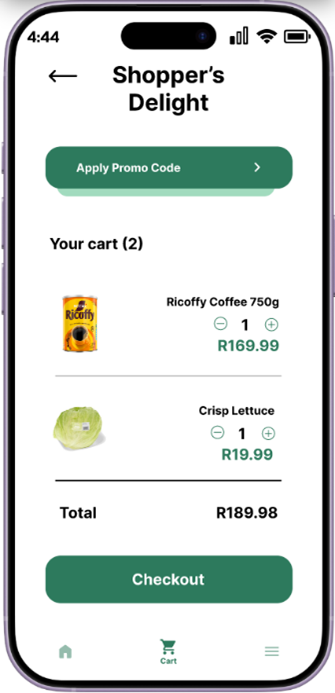

### Manage delivery

* The screens allow the customer to input their delivery address, choose a preferred delivery time slot and provide delivery instructions. This fulfils the manage delivery use case

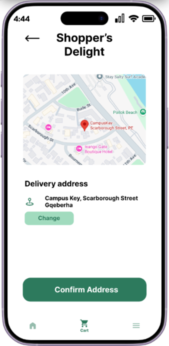
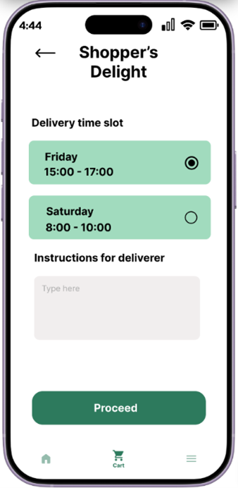

### Purchase

* These screens enable the customer to make secure online payments through a method they prefer and then confirm success of the purchase.
* Use cases that are affected here are process transactions, update product availability and manage product inventory

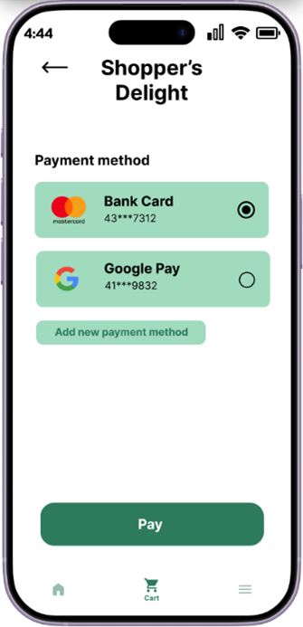
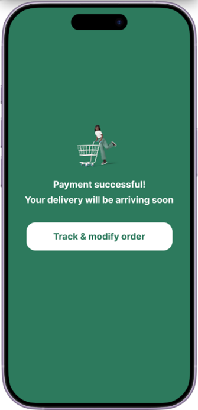

### Menu

* From the menu screen you can find the Track & modify order option.
* By following this option the customer will be able to see the delivery status of their order and be able to modify it within the stipulated timeframe.
* This fulfils the cancel/modify order and update customer delivery status use cases
* Furthermore, the customer can view their order history from the menu.
* This fulfils the access order history use case
* The menu also provides the option to report matters on the app. Upon pressing the Report option, the customer will be able to file their report.
* This fulfils the file enquiries & complaints and handle customer support use cases

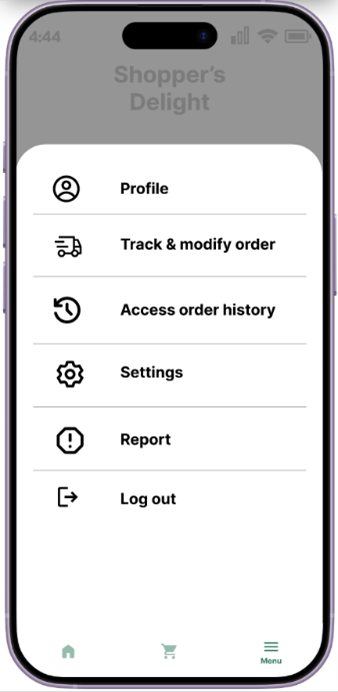
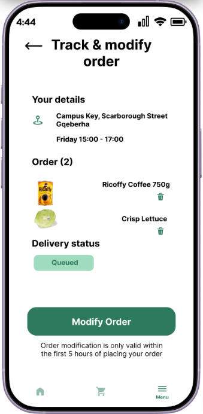
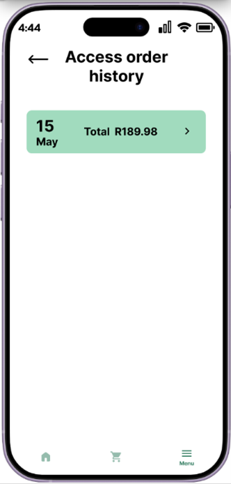
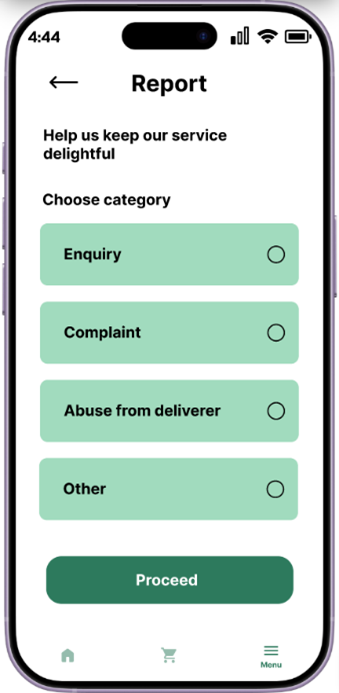

### Home - Deliverer side

* Shows the delivery requests available for the deliverer, fulfilling the send delivery request to deliverer use case

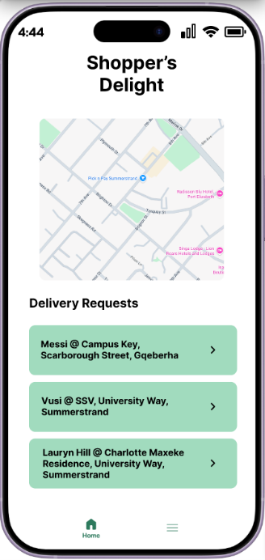

### Delivery request details

* This screen gives the deliverer further information about a delivery and allows them the opportunity to accept the request.
* This fulfils the notify deliverer on order details use case

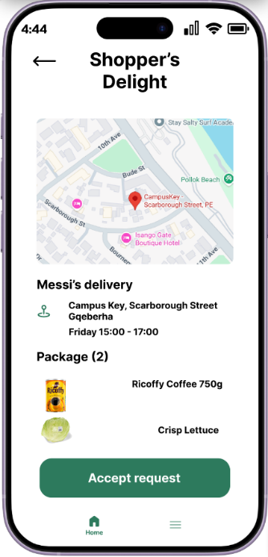

### Delivery route to destination

* Shows the recommended route to the destination and alternatives that are available.
* This displays the distance of the trip and how long it is expected to take.
* The use cases fulfilled here are calculate delivery distance and optimize delivery route

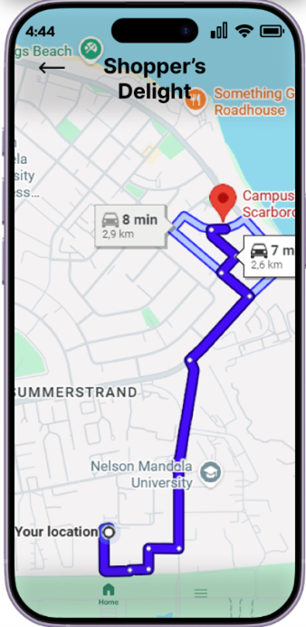

### Arrived at destination

* Alerts the deliverer that they have arrived at their destination and gives them the option to contact the customer and let them know their order has arrived.
* The deliverer can then update the status of the delivery to whether it is complete or a no show (meaning the customer did not show up to fetch their order).
* This fulfils the track delivery use case

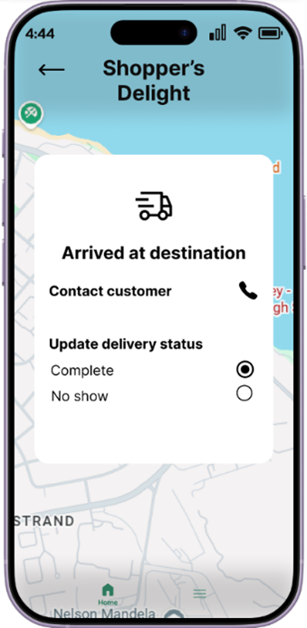

### Menu - Deliverer side

* Has the functionality to view current delivery and delivery history

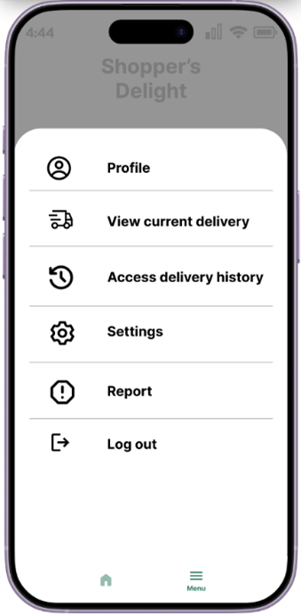

### New deliverer's home screen

* When a deliverer has recently created their account, this is the screen they will see once they sign-in. They cannot receive delivery requests until they are verified

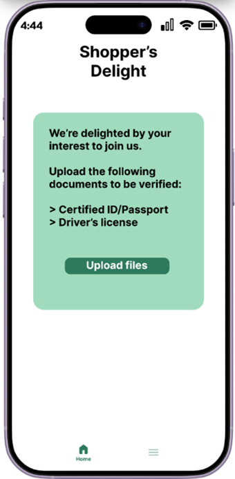

## Prototype flow

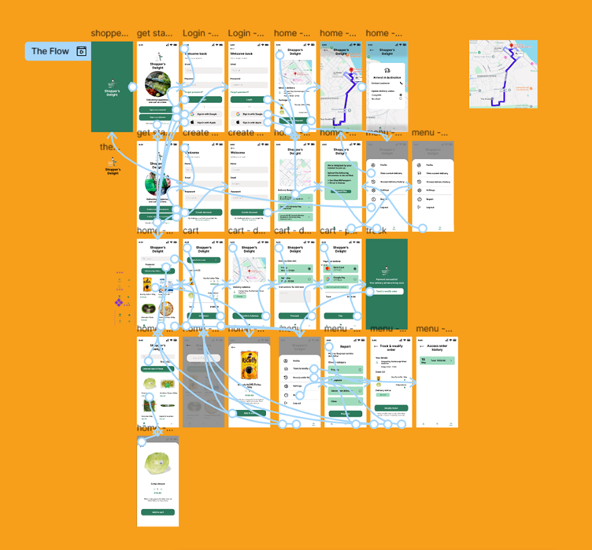

